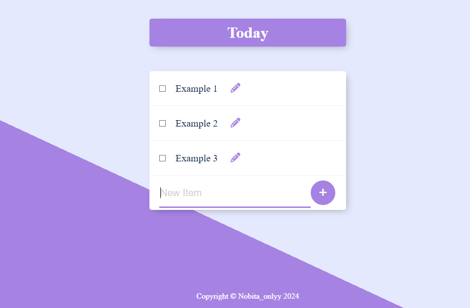

# Better-Todo-list
This is Better todo-list application  built with Node.js, Express.js and postgres sql for database allowing users to create, read, update, and delete Todo list.

# Features
1 . A clean looking interface. <br>
2. Ability to read update edit delete the todo list. <br>
3. Simplified code and easy to understand. 


# Technologies Used
Node.js

Express.js

PostgresSql (for database)

Ejs/CSS (for front-end templates)

# Installation

1 . Clone the repository:

``` bash
git clone https://github.com/Mythsoul/Better-Todo-list.git

```
2 . Open project folder
```bash
cd Better-todo-list
```

3 . Install dependencies:

```bash
npm install
```

4 . Enter ur database detail:

```bash
 
const db = new pg.Client({
  user : 'youruser', 
  host : 'yourhost ex: localhost',
  database : 'databasenaame',
  password : 'password', 
  port : 'port'
}); 
```
5 . Open pg admin and Use the queries.sql command in desired database . 
```javascript
CREATE TABLE items (
  id SERIAL PRIMARY KEY,
  title VARCHAR(100) NOT NULL
);
``` 
6. Start the application. 
```bash 
nodemon index.js
```

# Usage
Use the application : Navigate to http://localhost:3000 to see the todo list . 

# image 


# Contributing
Contributions are welcome! If you have any suggestions, improvements, or issues, please feel free to open an issue or create a pull request.


